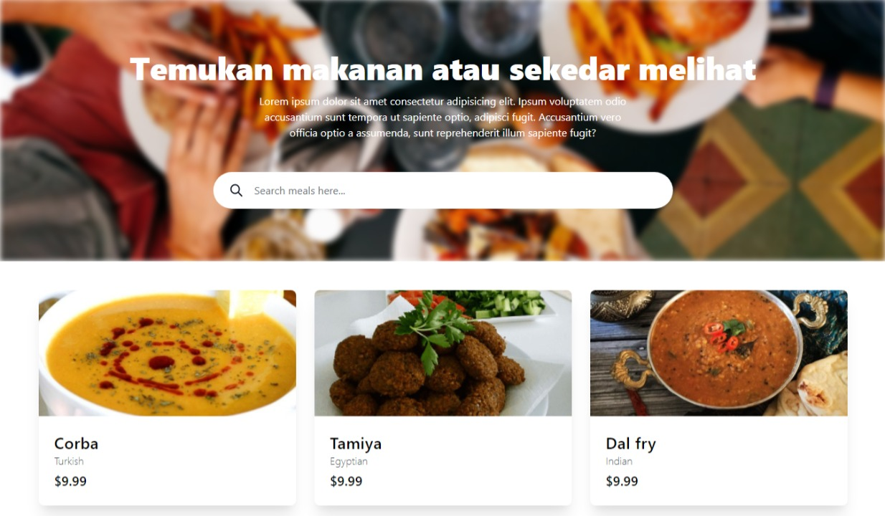
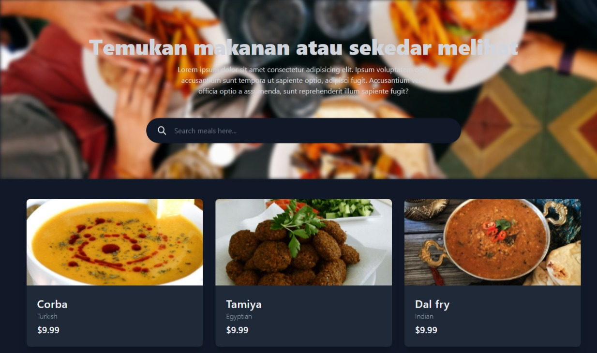
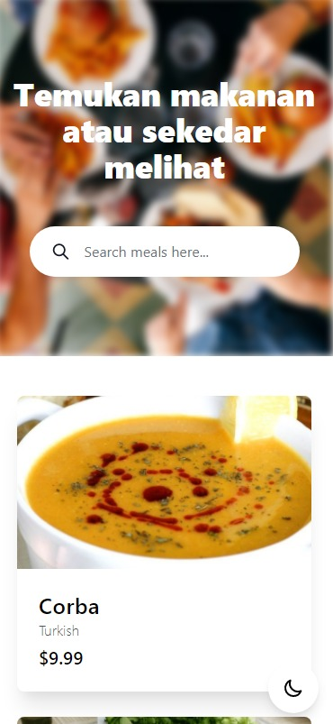

# Meols - Temukan berbagai makanan dan minuman

Meols project sebagai latihan dari hasil belajar [React](https://reactjs.org/) dan [Tailwindcss](https://tailwindcss.com/)

Teknologi digunakan :

- [Vitejs](https://vitejs.dev/)
- [React](https://reactjs.org/)
- [Tailwindcss](https://tailwindcss.com/)
- [React Hooks](https://reactjs.org/docs/hooks-intro.html)
- Function Components

Resources :

- [The Meal DB](https://www.themealdb.com/api.php)
- [Tailwind JIT](https://tailwindcss.com/docs/just-in-time-mode)
- [Unsplash](https://unsplash.com/)

Screenshot :

- Desktop

  

  

- Mobile

  

Author :

- [bayu07750](https://twitter.com/bayu07750)
